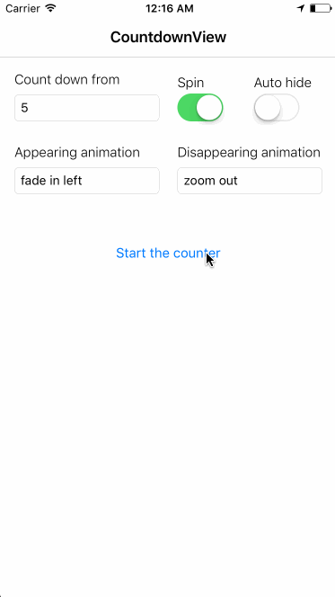

CountdownView
========================

<a href="https://developer.apple.com/swift"></a>
<a href="https://developer.apple.com/ios"></a>


## Preview




## Installation

CountdownView is available through [CocoaPods](http://cocoapods.org). To install
it, simply add the following line to your Podfile:

```ruby
pod "CountdownView"
```

## Usage
1. import the pod

  ```swift
  import CountdownView
  ```

2. use the basic show method or the one with completion block and automatic hiding

  ```swift
  CountdownView.show(countdownFrom: Double, spin: Bool, animation: Animation)
  ```

  ```swift
  CountdownView.show(countdownFrom: Double, spin: Bool, animation: Animation, autoHide: Bool, completion: (()->())?)
  ```

3. hide if you didn't use auto hiding

  ```swift
  CountdownView.hide(animation: Animation, options: (duration: Double, delay: Double), completion: (()->())?)
  ```
### Animation options

- fadeIn
- fadeOut
- fadeInLeft
- fadeInRight
- fadeOutLeft
- fadeOutRight
- zoomIn
- zoomOut

## Requirements

- iOS 9.0+
- Swift 3+
- ARC

## License

CountdownView is available under the MIT license. See the LICENSE file for more info.
